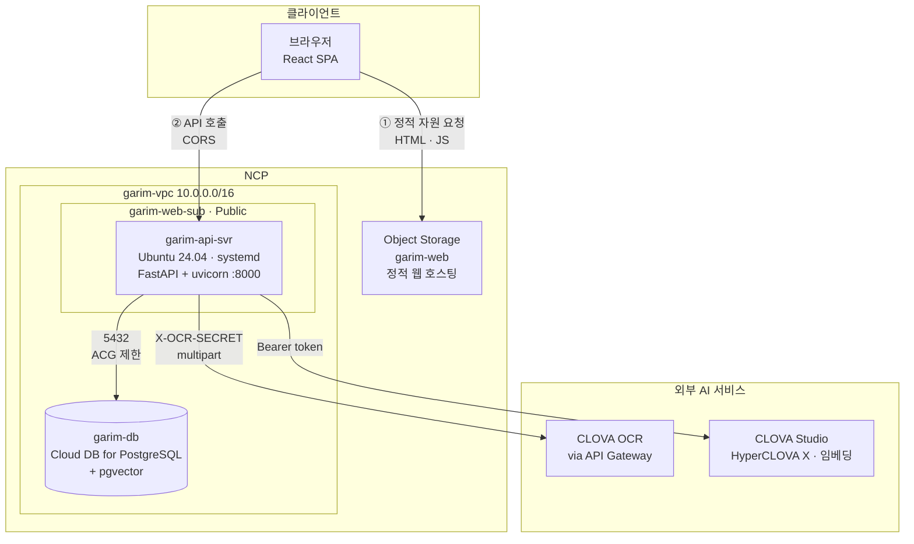
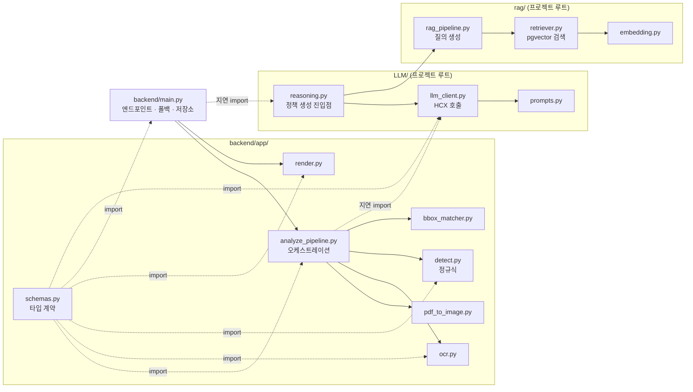
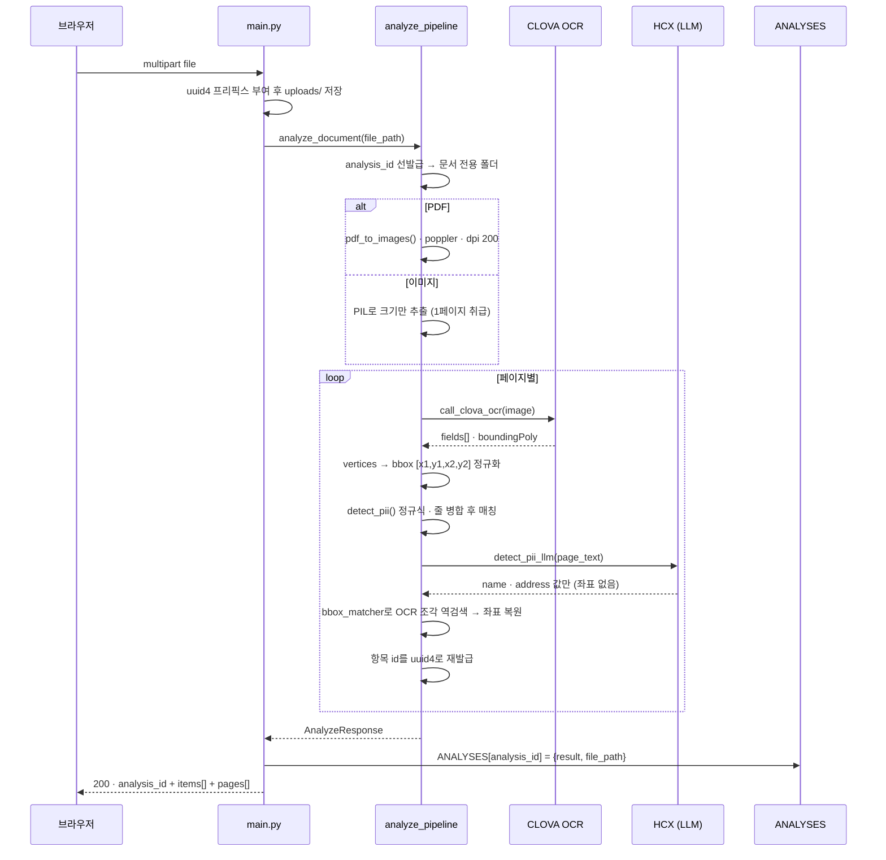
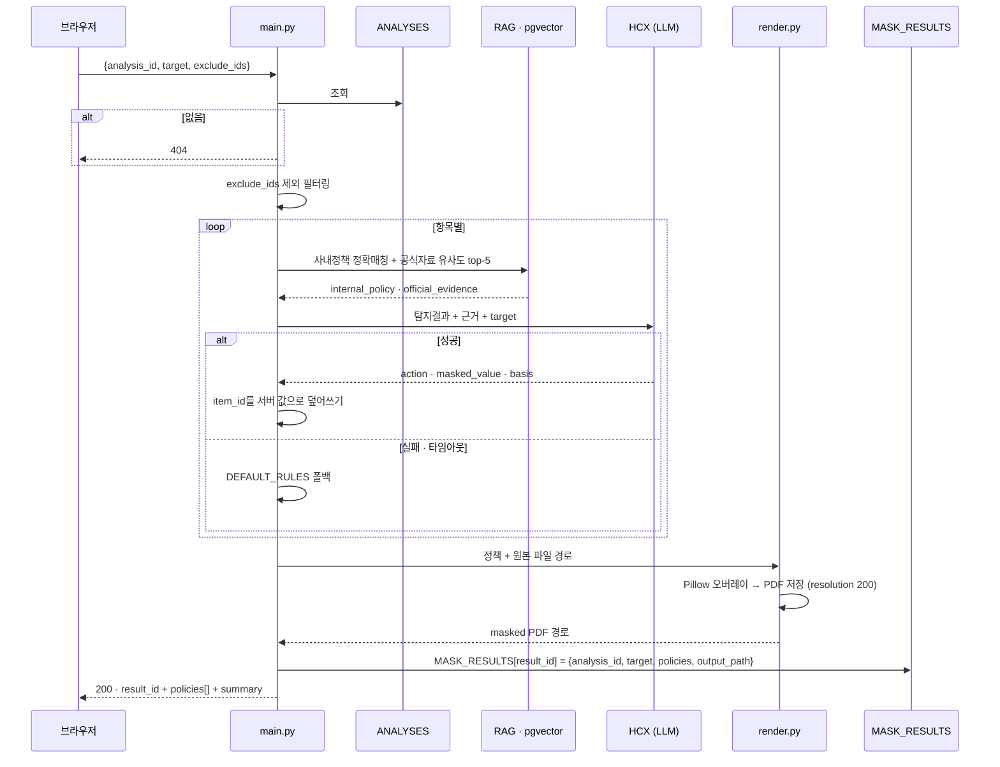
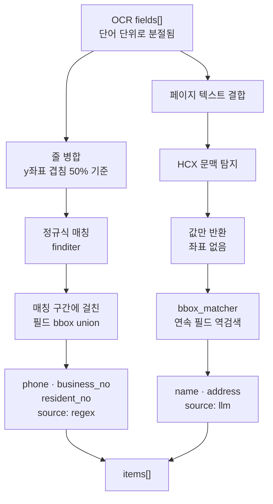
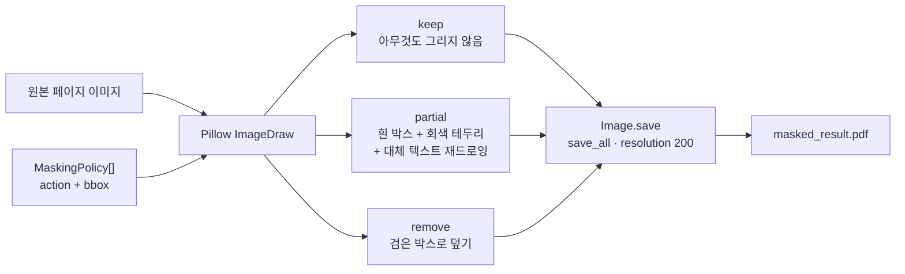
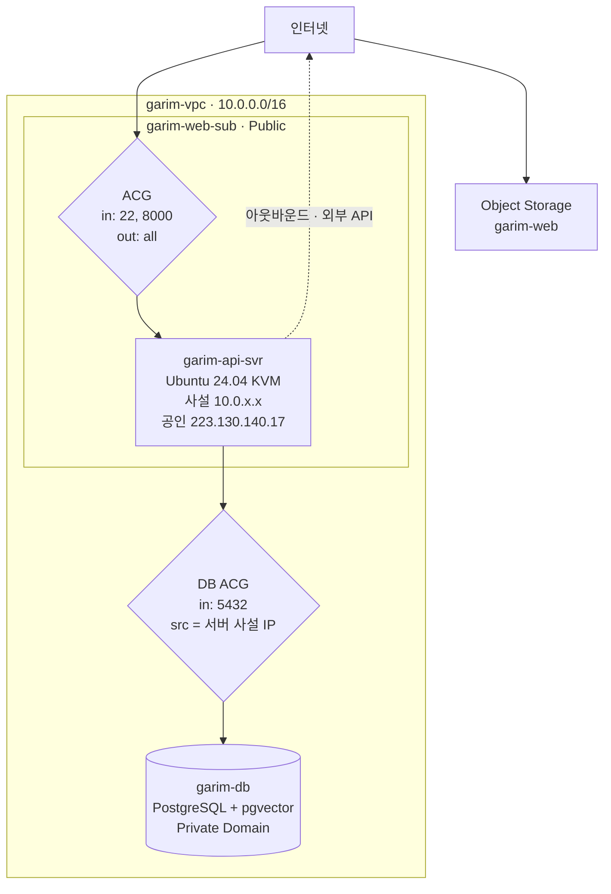
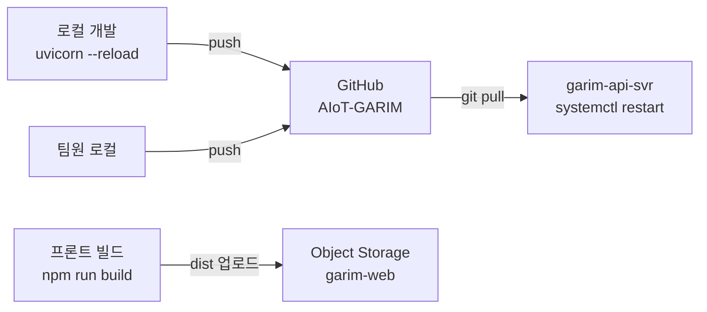

# GARIM Backend — 아키텍처 & API

문서에서 개인정보를 탐지하고, **공유 대상(사내·협력사·외부)에 따라 다른 수준으로 마스킹**한
PDF를 생성하는 서비스의 백엔드.

- **런타임**: Python 3.12 · FastAPI · uvicorn (systemd 상시 기동)
- **배포**: NCP Server `223.130.140.17:8000` (VPC 내 Public Subnet)
- **Docs**: [`/docs`](http://223.130.140.17:8000/docs) (Swagger UI) · [`/openapi.json`](http://223.130.140.17:8000/openapi.json)
- **프론트**: Object Storage 정적 호스팅 — API와 오리진 분리 (CORS)

### 담당: 백엔드 / 인프라

| 구분       | 내용                                                                             |
| ---------- | -------------------------------------------------------------------------------- |
| API 계층   | `/health` · `/analyze` · `/mask` · `/download` 설계 및 구현 ([main.py](main.py)) |
| 파이프라인 | OCR → 정규식·LLM 탐지 → bbox 매칭 → 마스킹 렌더링 ([app/](app/))                 |
| 타입 계약  | 팀 공용 Pydantic 스키마 ([app/schemas.py](app/schemas.py))                       |
| 인프라     | NCP VPC/Subnet·ACG, Server, Cloud DB for PostgreSQL(pgvector), Object Storage    |
| 운영       | systemd 서비스(`garim`) 구성, `journalctl` 기반 장애 진단                        |

### 목차

[1. 시스템 구성](#1-시스템-구성) · [2. 모듈 구조](#2-모듈-구조) · [3. 요청 처리 흐름](#3-요청-처리-흐름) ·
[4. API 명세](#4-api-명세) · [5. 개인정보 탐지 전략](#5-개인정보-탐지-전략) ·
[6. 마스킹 렌더링](#6-마스킹-렌더링) · [7. 상태 관리](#7-상태-관리) ·
[8. 장애 대응 설계 · 로깅 정책](#8-장애-대응-설계) ·
[9. 인프라](#9-인프라) · [10. 서비스 운영](#10-서비스-운영) · [11. 배포 파이프라인](#11-배포-파이프라인) ·
[12. 기술 스택](#12-기술-스택) · [13. 로컬 실행과 테스트](#13-로컬-실행과-테스트) ·
[14. 실행 화면](#14-실행-화면) · [15. 성능](#15-성능) · [16. 확장 시 고려사항](#16-확장-시-고려사항)

---

## 1. 시스템 구성



**핵심 설계 — 정적 자원과 API의 분리**

Object Storage는 서버가 아니라 파일 저장소이므로 스스로 API를 호출하지 않는다.
빌드 산출물을 브라우저에 내려주는 것까지가 역할이고, **API 호출 주체는 브라우저**다.
따라서 `Object Storage → API 서버` 경로는 존재하지 않으며, 브라우저 기준으로
두 개의 오리진(정적 호스팅 / API 서버)에 접근하는 구조가 된다. 이 때문에 API 서버에
CORS 미들웨어가 필수이며, 스캐폴딩 단계부터 포함시켰다.

---

## 2. 모듈 구조

`LLM/`·`rag/`는 `backend/` 밖, 프로젝트 루트에 있는 별도 패키지다.
팀원별 담당 영역이 폴더로 나뉘어 있어 백엔드가 그 경계를 넘지 않고 호출만 한다.



| 파일                                               | 책임                                                          | 외부 의존              |
| -------------------------------------------------- | ------------------------------------------------------------- | ---------------------- |
| [main.py](main.py)                                 | 엔드포인트 정의, 파일 저장, 오케스트레이션, 정책 폴백, 저장소 | —                      |
| [app/schemas.py](app/schemas.py)                   | 팀 공용 Pydantic 타입 계약                                    | pydantic               |
| [app/analyze_pipeline.py](app/analyze_pipeline.py) | 변환 → OCR → 탐지 → 좌표 복원 조립                            | —                      |
| [app/pdf_to_image.py](app/pdf_to_image.py)         | PDF → 페이지 PNG (dpi 200)                                    | pdf2image, poppler     |
| [app/ocr.py](app/ocr.py)                           | CLOVA OCR 호출, 응답 → `OcrPage` 변환                         | requests, CLOVA OCR    |
| [app/detect.py](app/detect.py)                     | 정규식 탐지 (전화·사업자·주민번호)                            | re                     |
| [app/bbox_matcher.py](app/bbox_matcher.py)         | LLM 탐지값 ↔ OCR 조각 좌표 매칭                               | —                      |
| [app/render.py](app/render.py)                     | 마스킹 오버레이 및 PDF 생성                                   | Pillow                 |
| [app/log_safe.py](app/log_safe.py)                 | 로그용 값 마스킹·예외 라벨 (§8 로깅 정책)                     | —                      |
| `LLM/reasoning.py`                                 | RAG 검색 + 정책 판단을 묶는 진입점 (`generate_policy`)        | —                      |
| `LLM/llm_client.py` · `prompts.py`                 | HCX 호출, 이름·주소 탐지, 정책 판단                           | CLOVA Studio (HCX-007) |
| `rag/rag_pipeline.py` · `retriever.py`             | 정책 문서 검색 (사내정책 + 공식자료)                          | psycopg2, pgvector     |
| `rag/embedding.py`                                 | 질의 임베딩 생성 (`clir-emb-dolphin`)                         | CLOVA Studio           |

### import 규칙

uvicorn의 `WorkingDirectory`가 Python의 import root를 결정한다.
서버는 `/opt/garim/backend`에서 기동하므로 `app`이 최상위 패키지가 된다.

```python
from app.schemas import OcrPage        # ✅
from backend.app.schemas import ...    # ❌ ModuleNotFoundError
```

로컬 실행 시에도 저장소 루트가 아닌 `backend/` 디렉터리에서 실행해야 동일 조건이 된다.

다만 `LLM/`·`rag/`는 `backend/` 밖에 있어 이 규칙만으로는 잡히지 않는다.
서버의 `PYTHONPATH` 설정에 의존하지 않도록 [analyze_pipeline.py](app/analyze_pipeline.py)에서
**프로젝트 루트를 직접 `sys.path`에 넣는다.**

```python
_PROJECT_ROOT = Path(__file__).resolve().parent.parent.parent
if str(_PROJECT_ROOT) not in sys.path:
    sys.path.insert(0, str(_PROJECT_ROOT))
```

### 지연 import

`main.py` 최상단에서 `analyze_pipeline`이나 `LLM.reasoning`을 import하지 않고
**엔드포인트 안에서 가져온다.** 두 모듈은 로드 시점에 CLOVA 클라이언트를 만들고
`.env`를 읽으므로, 최상단에 두면 외부 API 키 문제나 DB 장애가 **서비스 기동 자체를
막는다.** 요청 시점으로 미루면 서버는 정상적으로 뜨고 `/health`도 응답하며,
해당 기능만 폴백으로 처리된다.

---

## 3. 요청 처리 흐름

### 3.1 `POST /analyze` — 탐지



**설계 포인트**

| 항목                                       | 결정                       | 근거                                                                                                                                                                             |
| ------------------------------------------ | -------------------------- | -------------------------------------------------------------------------------------------------------------------------------------------------------------------------------- |
| 엔드포인트를 `async def`가 아닌 `def`로 선언 | 동기 함수                  | OCR·LLM 호출이 전부 동기 blocking. `async def` 안에서 `await` 없이 동기 호출하면 이벤트 루프가 멈춰 `/health`까지 응답 불가. 일반 `def`는 FastAPI가 스레드풀에서 실행 |
| 업로드 파일명에 UUID 프리픽스              | `{uuid4}_{원본명}`         | 동시 업로드 시 파일명 충돌 방지, 원본명 보존                                                                                                                                     |
| 페이지 이미지를 `analysis_id` 폴더에 저장  | 문서 한 건당 하나의 폴더   | `pdf_to_images`가 `page_1.png` 고정 이름을 쓴다. 공용 폴더를 쓰면 동시 요청이 서로의 페이지를 덮어써 **남의 계약서가 섞인 결과**가 나간다                                        |
| LLM이 매긴 항목 id를 버리고 UUID 재발급    | `str(uuid4())`             | LLM은 페이지마다 `"1","2"`부터 다시 매겨서 서로 다른 항목이 같은 id를 갖는다. 그대로 두면 마스킹 정책이 엉뚱한 항목에 적용된다                                                    |
| CLOVA 응답 구조 격리                       | `ocr.py` 밖으로 노출 안 함 | `detect`·`render`는 `OcrPage`만 알면 됨. OCR 벤더 교체 시 영향 범위를 한 파일로 한정                                                                                              |
| 좌표계 통일                                | 모든 입력을 이미지로 변환 후 OCR | OCR이 본 픽셀과 마스킹할 픽셀이 동일해야 좌표가 1:1로 맞음                                                                                                                   |

### 3.2 `POST /mask` — 판단 및 렌더링



**LLM이 채운 `item_id`는 신뢰하지 않는다.** 응답을 받은 즉시 서버가 알고 있는 값으로
덮어쓴다. 여기가 어긋나면 프론트에서 "어떤 항목의 정책인지" 매칭이 조용히 깨지고,
사용자는 잘못된 근거를 정상 화면으로 보게 된다.

```python
policy = generate_policy(DetectedItem.model_validate(item), req.target)
policy.item_id = item["id"]
```

**RAG는 2트랙 검색**이다. 사내 정책은 `pii_type × target`이 정확히 일치하는 행을
1건 가져오고(벡터 검색 아님), 법령·가이드 같은 공식자료는 임베딩 코사인 유사도로
상위 5건을 가져온다. 프롬프트는 사내 정책을 우선하고 공식자료는 보조 근거로만 쓰게 한다.

### 3.3 `GET /download/{result_id}`

`MASK_RESULTS`에서 PDF 경로를 조회해 `FileResponse`로 반환.
`content-disposition: attachment; filename="masked_result.pdf"`

---

## 4. API 명세

| Method | Endpoint                | 설명                            |
| ------ | ----------------------- | ------------------------------- |
| `GET`  | `/health`               | 헬스체크                        |
| `POST` | `/analyze`              | 문서 업로드 → OCR·개인정보 탐지 |
| `POST` | `/mask`                 | 공유 대상별 마스킹 정책 생성    |
| `GET`  | `/download/{result_id}` | 마스킹 완료 PDF 다운로드        |

**에러 응답은 모든 엔드포인트가 FastAPI 기본 형태를 따른다.** 본문은 `detail` 한 필드뿐이며,
프론트는 상태 코드로 분기하고 `detail`을 사용자 메시지로 그대로 노출해도 된다
(개인정보는 담기지 않는다).

```json
{ "detail": "지원하지 않는 형식입니다. 허용: .jpeg, .jpg, .pdf, .png" }
```

`422`(Pydantic 검증 실패)만 예외적으로 `detail`이 배열이며, 어떤 필드가 왜 실패했는지
객체 목록으로 담긴다.

### `GET /health`

서버 상태 확인. 배포 검증 및 장애 1차 진단용.

```json
{ "status": "ok", "service": "garim" }
```

### `POST /analyze`

문서를 업로드해 OCR 수행 후 개인정보를 탐지한다. PDF는 내부에서 페이지별 이미지로 변환된다.

**Request** — `multipart/form-data`

| 필드   | 타입   | 필수 | 설명                            |
| ------ | ------ | ---- | ------------------------------- |
| `file` | binary | ✅   | 계약서 이미지(jpg/png) 또는 PDF |

**업로드 제한** — 프론트에서도 검사하지만 브라우저 단이라 우회가 가능하므로 서버에서 다시 막는다.

| 항목   | 제한                              | 위반 시 |
| ------ | --------------------------------- | ------- |
| 확장자 | `.jpg` `.jpeg` `.png` `.pdf`      | `415`   |
| 크기   | 20MB                              | `413`   |

크기는 파일을 조각 단위로 저장하면서 누적 검사한다. 다 읽은 뒤에 재면 그 시점에 이미
메모리를 다 쓴 뒤라 제한이 의미가 없다. 거부된 업로드의 부분 파일은 즉시 삭제한다.
파일명은 `os.path.basename`으로 잘라 저장 경로가 `uploads/` 밖을 가리킬 여지를 없앤다.

**Response 200**

| 필드          | 타입         | 설명                                       |
| ------------- | ------------ | ------------------------------------------ |
| `analysis_id` | string(uuid) | 분석 세션 ID — `/mask` 호출 시 사용        |
| `filename`    | string       | 저장된 파일명 (UUID 프리픽스 부여)         |
| `page_count`  | int          | 총 페이지 수                               |
| `items[]`     | array        | 탐지된 개인정보 목록                       |
| `pages[]`     | array        | 페이지별 OCR 결과 (프론트 문서 미리보기용) |

**`items[]` 항목**

| 필드     | 타입         | 설명                                                           |
| -------- | ------------ | -------------------------------------------------------------- |
| `id`     | string(uuid) | 항목 ID                                                        |
| `type`   | enum         | `name` `phone` `address` `account` `business_no` `resident_no` |
| `value`  | string       | 탐지된 값                                                      |
| `page`   | int          | 페이지 번호 (1부터)                                            |
| `bbox`   | int[4]       | `[x1, y1, x2, y2]` 픽셀 좌표 (좌상단 원점)                     |
| `source` | enum         | `regex`(패턴 탐지) · `llm`(문맥 탐지)                          |

> 전화번호·사업자번호·주민번호는 정규식으로, 이름·주소는 LLM으로 탐지한다.
> LLM 탐지 결과에는 좌표가 없으므로 OCR 텍스트 조각과 매칭해 `bbox`를 채운다.
> `account`는 스키마상 정의돼 있으나 현재 정규식·LLM 어느 쪽에서도 탐지하지 않는다
> (탐지되면 정책·폴백 규칙은 이미 준비돼 있다).

**`pages[]` 항목**

| 필드                        | 타입  | 설명                               |
| --------------------------- | ----- | ---------------------------------- |
| `page` / `width` / `height` | int   | 페이지 번호 및 이미지 크기         |
| `fields[]`                  | array | `{ text, bbox }` — OCR 텍스트 조각 |

<details>
<summary>응답 예시</summary>

```json
{
  "analysis_id": "96d13c40-8f03-402a-a633-5fec1308e8a1",
  "filename": "951177cc_계약서.jpg",
  "page_count": 1,
  "items": [
    {
      "id": "18a01254-727d-43a7-9fe2-c45bd7272fe6",
      "type": "name",
      "value": "홍길동",
      "page": 1,
      "bbox": [342, 197, 420, 217],
      "source": "llm"
    },
    {
      "id": "6ec8b07d-76d1-4735-ae42-f5cedd8920e3",
      "type": "address",
      "value": "서울특별시 강남구 테헤란로 123, 7층 (본사)",
      "page": 1,
      "bbox": [158, 334, 444, 352],
      "source": "llm"
    }
  ],
  "pages": [
    {
      "page": 1,
      "width": 758,
      "height": 1070,
      "fields": [
        { "text": "표준근로계약서(기간의", "bbox": [179, 89, 401, 114] }
      ]
    }
  ]
}
```

</details>

**에러**: `413` 20MB 초과 · `415` 허용하지 않는 확장자 · `422` 파일 누락
· `500` OCR 키 미설정 또는 poppler 미설치 상태의 PDF 업로드

### `POST /mask`

탐지 결과와 공유 대상을 받아 항목별 마스킹 정책을 생성하고, 마스킹된 PDF를 만든다.
RAG로 검색한 정책 근거가 `basis`에 포함된다.

**Request** — `application/json`

| 필드          | 타입     | 필수 | 설명                                     |
| ------------- | -------- | ---- | ---------------------------------------- |
| `analysis_id` | string   | ✅   | `/analyze` 응답의 ID                     |
| `target`      | enum     | ✅   | `internal` · `partner` · `public`        |
| `exclude_ids` | string[] |      | 사용자가 체크 해제한 항목 ID (기본 `[]`) |

**Response 200**

| 필드         | 타입         | 설명                               |
| ------------ | ------------ | ---------------------------------- |
| `result_id`  | string(uuid) | 결과 ID — `/download` 호출 시 사용 |
| `target`     | enum         | 적용된 공유 대상                   |
| `policies[]` | array        | 항목별 마스킹 정책                 |
| `summary`    | string       | 집계 요약                          |

**`policies[]` 항목**

| 필드            | 타입           | 설명                                      |
| --------------- | -------------- | ----------------------------------------- |
| `item_id`       | string         | 대상 항목 ID                              |
| `action`        | enum           | `keep` · `partial` · `remove`             |
| `masked_value`  | string \| null | `partial`일 때 치환값 (그 외에는 값 없음) |
| `basis.doc`     | string         | 근거 문서명                               |
| `basis.clause`  | string         | 근거 조항                                 |
| `basis.summary` | string         | 판단 근거 요약                            |

**공유 대상별 처리 결과 비교** (동일 문서 · 동일 `analysis_id`)

| 탐지 항목                 | `internal`                    | `public`                      |
| ------------------------- | ----------------------------- | ----------------------------- |
| 성명 `홍길동`             | `keep`                        | `remove`                      |
| 주소 `서울특별시 강남구…` | `keep`                        | `remove`                      |
| 집계                      | keep 2 / partial 0 / remove 0 | keep 0 / partial 0 / remove 2 |

<details>
<summary>internal — 내부 공유 (응답 예시)</summary>

```json
{
  "result_id": "2b045e7e-5d01-45ad-8517-6cec09e9ad03",
  "target": "internal",
  "policies": [
    {
      "item_id": "18a01254-727d-43a7-9fe2-c45bd7272fe6",
      "action": "keep",
      "masked_value": "",
      "basis": {
        "doc": "GARIM 가상 사내 문서 공유 보안정책",
        "clause": "개인정보 유형 name · 공유 대상 internal · 처리 keep",
        "summary": "내부 정책에 따르면 내부 업무 수행에 필요한 개인 식별정보는 유지하도록 되어 있습니다."
      }
    },
    {
      "item_id": "6ec8b07d-76d1-4735-ae42-f5cedd8920e3",
      "action": "keep",
      "masked_value": "",
      "basis": {
        "doc": "GARIM 가상 사내 문서 공유 보안정책",
        "clause": "개인정보 유형 address · 공유 대상 internal · 처리 keep",
        "summary": "업무상 필요한 내부 문서에서는 권한이 있는 구성원에게 주소 정보를 유지할 수 있다."
      }
    }
  ],
  "summary": "internal 기준 총 2건: keep 2건, partial 0건, remove 0건"
}
```

</details>

<details>
<summary>public — 외부 공개 (응답 예시)</summary>

```json
{
  "result_id": "b39e0399-63df-4705-9514-c123f2aa7574",
  "target": "public",
  "policies": [
    {
      "item_id": "18a01254-727d-43a7-9fe2-c45bd7272fe6",
      "action": "remove",
      "masked_value": "",
      "basis": {
        "doc": "GARIM 가상 사내 문서 공유 보안정책",
        "clause": "외부 공개 문서에서는 개인 식별 가능성을 낮추기 위해 이름을 제거한다.",
        "summary": "GARIM 사내 문서 공유 정책에서 개인정보는 이름이고, 공유 대상은 public이며, 처리 방법은 remove이다."
      }
    },
    {
      "item_id": "6ec8b07d-76d1-4735-ae42-f5cedd8920e3",
      "action": "remove",
      "masked_value": "[주소 정보 삭제]",
      "basis": {
        "doc": "GARIM 가상 사내 문서 공유 보안정책",
        "clause": "외부 공개 시 개인의 거주지 등을 특정할 수 있는 주소 정보는 제거한다.",
        "summary": "GARIM 사내 문서 공유 정책에 따르면, 외부 공개 시 개인의 거주지를 특정할 수 있는 주소 정보는 제거해야 합니다."
      }
    }
  ],
  "summary": "public 기준 총 2건: keep 0건, partial 0건, remove 2건"
}
```

</details>

> 동일한 `analysis_id`로 `target`만 바꿔 재호출하면 재분석 없이 정책이 다시 산출된다.
> `result_id`는 호출마다 새로 발급되므로, `/download` 시 해당 `target`으로 생성된 `result_id`를 사용해야 한다.

**에러**: `404` `analysis_id` 없음 · `422` 요청 형식 오류
PDF 생성이 실패해도 정책 응답은 `200`으로 반환하고, 이후 `/download`가 `404`가 된다.

### `GET /download/{result_id}`

마스킹 완료된 PDF를 내려받는다.

| 파라미터    | 위치 | 설명              |
| ----------- | ---- | ----------------- |
| `result_id` | path | `/mask` 응답의 ID |

**Response 200** — `application/pdf`
`content-disposition: attachment; filename="masked_result.pdf"`

**에러**: `404` 결과 없음 또는 파일 생성 실패

### 전체 호출 흐름

```
POST /analyze  →  analysis_id
      ↓
POST /mask     →  result_id  (target 변경 시 analysis_id 재사용)
      ↓
GET /download/{result_id}  →  masked PDF
```

---

## 5. 개인정보 탐지 전략

패턴으로 판별 가능한 것은 결정적 코드로, 문맥 이해가 필요한 것만 LLM으로 분리했다.



**문제 ①: OCR 분절로 정규식이 실패**

CLOVA OCR General은 텍스트를 단어 단위로 반환한다. `010-1234-5678`이
`"010"` / `"1234"` / `"5678"`로 나뉘면 필드 단위 정규식은 매칭되지 않는다.

→ y좌표가 겹치는 필드를 같은 줄로 묶어 하나의 문자열로 이어붙인 뒤 정규식을 적용하고,
매칭 구간에 걸친 필드들의 bbox를 union해 좌표를 산출한다.
구분자는 `[-\s]{1,3}`으로 허용해 필드 결합 시 삽입되는 공백을 흡수한다
(OCR이 하이픈까지 별도 필드로 쪼개면 구분자가 `" - "` 3글자가 될 수 있다).
전화번호 패턴은 휴대폰(`01x`)뿐 아니라 지역번호 유선전화(`02`, `031` 등)도 잡는다.
탐지된 값은 `re.sub(r"[\s-]+", "-", ...)`로 하이픈 표기를 통일해 저장한다.

**문제 ②: LLM 탐지 결과에 좌표가 없음**

LLM은 텍스트만 보므로 원본 이미지 좌표를 알 수 없다. `DetectedItem.bbox`는 필수이고
`render.py`가 이 값으로 마스킹을 그리므로, 비어 있으면 렌더링 단계에서 실패한다.

두 방안을 비교해 ②를 채택했다.

| 방안                       | 내용                                              | 판단                                        |
| -------------------------- | ------------------------------------------------- | ------------------------------------------- |
| ① 프롬프트에 좌표 주입     | 필드 목록 `[{id, text, bbox}]`을 넘기고 LLM이 id로 응답 | 토큰 비용 급증, LLM이 id를 잘못 매길 위험 |
| ② **OCR 역검색**           | LLM은 값만 반환, 그 값을 OCR 필드에서 검색해 좌표 복원 | 추론이 아닌 원본 좌표라 정확, 설계 원칙과 일관 |

주소처럼 값이 여러 필드에 걸친 경우(`서울특별시` / `강남구` / `테헤란로`)를 위해
연속 필드를 최대 8개까지 이어붙이며 탐색한다. 매칭 시작 위치를 문자 단위로 추적하므로
탐색을 시작한 필드가 값과 무관한 라벨이어도 bbox에 섞이지 않는다. 사용된 필드는
`used` 집합으로 재사용을 막아, 같은 값이 여러 번 등장해도 각각 다른 위치를 잡는다.
**매칭 실패 항목은 조용히 버리지 않고 로그를 남긴다** —
마스킹 서비스에서 탐지했으나 가려지지 않은 상태는 가장 위험한 실패 유형이기 때문이다.

---

## 6. 마스킹 렌더링



**이미지 재생성 방식의 보안적 이점**

원본 PDF의 텍스트 레이어를 편집하는 대신 이미지로 변환 후 픽셀을 덮고 새 PDF를 생성한다.
결과물에 원문 텍스트 레이어 자체가 존재하지 않으므로, **가림 처리 아래 원본 텍스트가 남아
복사·추출되는 사고**가 원천적으로 발생하지 않는다. 표·도장·서명 등 레이아웃도 그대로 보존된다.

`render_analysis`는 `AnalyzeResponse`가 아니라 **분석에 썼던 원본 파일 경로**를 다시 받는다.
`OcrPage`는 텍스트와 좌표만 갖고 이미지 경로를 남기지 않으므로, 분석 때와 똑같은 방식으로
페이지 이미지를 다시 만들어야 좌표가 어긋나지 않는다. 중간 산출물인 페이지 이미지는
**호출 전용 임시 폴더**에 풀고 작업이 끝나면 삭제한다 — 개인정보가 담긴 이미지를
디스크에 방치하지 않기 위해서다.

**실제로 겪은 렌더링 이슈**

| 증상                                          | 원인                                                                 | 대응                                             |
| --------------------------------------------- | -------------------------------------------------------------------- | ------------------------------------------------ |
| 한글 대체 텍스트가 `□*□`(두부)로 출력          | PIL 기본 폰트에 한글 글리프가 없음                                   | `backend/assets/NanumGothic-Regular.ttf` 동봉    |
| 대체 텍스트가 지나치게 작게 찍힘              | 기본 폰트 크기가 약 11px 고정, OCR 글자 높이는 보통 40px 이상        | bbox 높이의 80%로 키우고 가로로 넘치면 축소       |
| 서버 기동 직후 첫 `/mask`만 `KeyError('JPEG')` | PIL이 RGB→PDF 저장 시 JPEG 인코더를 쓰는데 플러그인 미등록 상태      | `from PIL import JpegImagePlugin` 명시 import    |
| 마스킹 PDF의 페이지 크기가 비정상             | 저장 시 해상도 미지정                                                | `resolution=200`으로 dpi 200 변환과 일치시킴      |

---

## 7. 상태 관리

MVP 범위에서 분석·마스킹 결과는 프로세스 메모리에 보관한다.

```python
ANALYSES:     dict[analysis_id, {"result": dict, "file_path": str}]
MASK_RESULTS: dict[result_id,   {"analysis_id": str, "target": str,
                                 "policies": [...], "output_path": str | None}]
```

**두 저장소를 분리한 이유**

같은 문서를 대상만 바꿔 여러 번 마스킹할 수 있다. 두 저장소를 하나로 합치면
나중 마스킹이 앞선 `result_id`의 결과 파일까지 덮어써서, **외부 공개용으로 발급한 링크가
내부용(개인정보가 덜 가려진) 파일을 내려주는** 사고로 이어진다.
분석 결과는 재사용하되 마스킹 결과는 호출마다 독립적으로 보관한다.

**대상 전환 최적화**: `target`만 바꾼 재호출은 `ANALYSES`를 재사용하므로
OCR·탐지를 건너뛰고 정책 판단부터 실행한다. 데모에서 협력사↔외부 전환이 즉시 반영된다.

**저장 경로** — 셋 다 개인정보가 담기므로 `.gitignore` 대상이며, 기동 시 24시간이
지난 파일을 삭제한다.

| 용도             | 경로                                             | 보관                |
| ---------------- | ------------------------------------------------ | ------------------- |
| 업로드 원본      | `/opt/garim/uploads`                             | 기동 시 24시간 경과분 삭제 |
| 마스킹 결과 PDF  | `/opt/garim/outputs`                             | 기동 시 24시간 경과분 삭제 |
| 페이지 이미지    | `GARIM_OUTPUT_DIR` 또는 `<프로젝트 루트>/output_images` | 기동 시 24시간 경과분 삭제 |

> **한계 ① 메모리 저장소**: 프로세스 재시작 시 초기화되며 다중 인스턴스로 확장할 수 없다.
>
> **한계 ② 파일 정리 주기**: 정리는 **기동 시 1회**가 전부다. 프로세스가 계속 떠 있으면
> 그 사이 쌓인 파일은 그대로 남고, 재시작이 잦지 않은 운영 환경에서는 사실상 무기한
> 보관된다. 현재 설계의 결함이며, 운영 시 주기적 TTL 삭제와 상태 영속화(PostgreSQL 또는
> Object Storage, 저장 시 암호화)가 선행되어야 한다.

---

## 8. 장애 대응 설계

LLM과 RAG는 외부 API·DB에 의존하므로, 장애 시에도 응답이 끊기지 않도록
규칙 기반 정책으로 대체하고 `summary` 끝에 `(LLM 실패 N건은 기본 규칙 적용)`을 덧붙인다.

### 공유 대상별 기본 정책 (`DEFAULT_RULES`)

| type          | `internal` | `partner` | `public` |
| ------------- | ---------- | --------- | -------- |
| `name`        | keep       | keep      | remove   |
| `phone`       | keep       | partial   | remove   |
| `address`     | keep       | partial   | remove   |
| `account`     | keep       | remove    | remove   |
| `business_no` | keep       | keep      | remove   |
| `resident_no` | partial    | remove    | remove   |

폴백은 **더 안전한 쪽**으로 설계했다. 표에 없는 타입은 기본값을 `remove`로 두어,
마스킹 누락보다 과잉 마스킹을 택한다. 폴백 정책의 `basis`는
`개인정보보호법 제17조(개인정보의 제공)`으로 채워, 응답 형태가 정상 경로와 동일하게 유지된다.

### 기타 실패 지점 처리

| 지점                     | 실패 시                          | 영향                                     |
| ------------------------ | -------------------------------- | ---------------------------------------- |
| 허용 외 확장자·크기 초과 | 저장 전 거부 + 부분 파일 삭제    | `/analyze` 415·413, 파이프라인 미실행    |
| 기동 시 파일 정리 실패   | 로그만 남기고 통과               | 서버는 정상 기동, 파일은 다음 재시작에 재시도 |
| OCR 키 미설정            | `RuntimeError` 즉시 발생         | `/analyze` 500, 서버는 유지              |
| poppler 미설치           | PDF 변환 실패                    | PDF만 실패, 이미지 업로드는 정상         |
| LLM 모듈 로드 실패       | 이름·주소 탐지 생략              | 정규식 탐지만으로 `/analyze` 정상 응답   |
| DB 연결 불가 / 임베딩 실패 | RAG 검색 결과 없음             | 규칙 기반 정책으로 대체                  |
| bbox 매칭 실패           | 해당 항목 제외 + 로그            | 렌더링 전체 중단 방지                    |
| PDF 생성 실패            | `output_path = None` + 로그      | `/mask`는 200, 이후 `/download`가 404    |

**타임아웃은 전부 명시한다.** CLOVA OCR 30초, HCX 60초, 임베딩은 `(연결 5초, 응답 30초)`.
타임아웃이 없으면 API가 응답하지 않을 때 요청 스레드가 무한정 묶이고,
마스킹 항목 수만큼 스레드가 잠기면 서버 전체가 멈춘다.

### 로깅 정책

**탐지값과 OCR 원문은 로그에 남기지 않는다.** 개인정보를 가리는 서비스가 정작 서버
로그로 그 값을 흘리면 마스킹 자체가 무의미해진다. `journalctl` 로그는 파일로 남고
수집기로 전송되며, 마스킹된 PDF와 달리 접근 통제도 걸려 있지 않다.

| 대상                 | 기록 여부 | 기록 내용                          |
| -------------------- | --------- | ---------------------------------- |
| 탐지된 이름·주소·번호 | ✗         | `type`과 `item_id`만               |
| OCR 원문 텍스트      | ✗         | 텍스트 조각 수와 좌표만            |
| 업로드 파일명        | ✗         | 파일명에 사람 이름이 흔히 들어간다 |
| 예외 메시지 본문     | ✗         | 예외 클래스명 + HTTP 상태 코드     |

**실패 로그는 `item_id`와 `type`만 기록한다.** 값 없이도 어느 항목이 실패했는지
`/analyze` 응답과 대조해 추적할 수 있다. 이를 위해 항목의 UUID를 bbox 매칭보다
먼저 발급한다 — 매칭에 실패한 항목도 id를 갖게 하기 위해서다.

```python
logger.warning("bbox 매칭 실패로 항목 제외: type=%s item_id=%s page=%s",
               raw.type, raw.id, ocr_page.page)
```

**예외 메시지를 그대로 찍지 않는다.** 가장 놓치기 쉬운 유출 경로다. LLM 응답 파싱이
실패하면 `json.JSONDecodeError`의 메시지에 **LLM이 반환한 이름·주소 JSON 조각이 그대로
들어간다.** `logger.warning("...: %s", e)`는 그 자체로 개인정보를 출력하는 코드가 된다.
[`log_safe.exc_label`](app/log_safe.py)이 예외 종류와 HTTP 상태 코드만 남긴다.

로컬 확인용 출력에도 값을 그대로 쓰지 않는다. 터미널 기록과 캡처로 남기 때문에,
`log_safe.mask_for_log`로 첫 글자만 남긴다 (`김민수` → `김**`).

---

## 9. 인프라



| 리소스         | 사양 · 설정                                          |
| -------------- | ---------------------------------------------------- |
| VPC            | `garim-vpc` 10.0.0.0/16                              |
| Subnet         | `garim-web-sub` · Public (Internet Gateway 연결)     |
| ACG (서버)     | 인바운드 TCP 22 · 8000 / 아웃바운드 전체 허용        |
| Server         | `garim-api-svr` · Ubuntu 24.04 KVM · 공인 IP 할당    |
| Cloud DB       | `garim-db` · PostgreSQL · pgvector Extension · 단일 서버 |
| DB 접근제어    | Private Domain 경유, 서버 **사설 IP만** 5432 허용    |
| Object Storage | `garim-web` · 정적 웹사이트 호스팅 (index.html)      |
| CLOVA OCR      | Domain `garim-ocr` (General) · API Gateway 연동      |
| CLOVA Studio   | HyperCLOVA X (HCX-007) · 임베딩 `clir-emb-dolphin`   |

**네트워크 설계 판단**

- DB는 공인 도메인을 열지 않고 **Private Domain으로만** 접근. 인터넷 경로 자체를 제거
- DB ACG의 허용 소스를 `0.0.0.0/0`이 아닌 **애플리케이션 서버 사설 IP**로 한정 (최소 권한)
- 아웃바운드는 전체 허용. 인바운드만 설정하고 아웃바운드를 기본 허용으로 가정하면
  외부 API 호출·패키지 설치가 전부 타임아웃된다 (실제로 겪은 장애)

---

## 10. 서비스 운영

`systemd` 유닛으로 등록해 재부팅·비정상 종료 시 자동 복구한다.

```ini
[Unit]
Description=GARIM Masking Service
After=network.target

[Service]
WorkingDirectory=/opt/garim/backend
EnvironmentFile=/opt/garim/.env
ExecStart=/opt/garim/venv/bin/uvicorn main:app --host 0.0.0.0 --port 8000
Restart=always
User=root

[Install]
WantedBy=multi-user.target
```

`User=root`는 3일 일정상 전용 서비스 계정 분리를 생략한 것이며, 운영 시에는 업로드·출력
폴더에만 쓰기 권한을 가진 전용 계정으로 분리해야 한다.

기동할 때마다 24시간이 지난 업로드 원본·결과 PDF·페이지 이미지를 삭제한다(§7).
`Restart=always`와 맞물려, 비정상 종료 후 복구 시에도 정리가 함께 수행된다.

| 목적      | 명령                                                  |
| --------- | ----------------------------------------------------- |
| 배포      | `cd /opt/garim && git pull && systemctl restart garim` |
| 상태 확인 | `systemctl status garim --no-pager`                   |
| 로그 추적 | `journalctl -u garim -f`                              |
| 헬스체크  | `curl localhost:8000/health`                          |

**시크릿 관리**: `.env`를 `EnvironmentFile`로 주입하고 `chmod 600` 적용.
저장소에는 포함하지 않으며(`.gitignore`), 변수명만 담은
[`.env.example`](../.env.example)을 공유한다.

```
OCR_INVOKE_URL      # CLOVA OCR API Gateway Invoke URL
OCR_SECRET_KEY      # X-OCR-SECRET 헤더 값
CLOVA_STUDIO_KEY    # HCX / 임베딩 API 키

DB_HOST             # pgvector DB (Private Domain)
DB_PORT             # 기본 5432
DB_NAME
DB_USER
DB_PASSWORD

GARIM_OUTPUT_DIR    # (선택) 페이지 이미지 폴더. 생략 시 <루트>/output_images
```

---

## 11. 배포 파이프라인



**단일 진실 공급원(SSoT) 원칙**

GitHub를 유일한 원본으로 두고, **서버는 pull만 수행한다.**
서버에서 직접 코드를 수정하면 저장소에 반영되지 않아 다음 `pull`·`reset` 시 유실되고,
다른 팀원이 clone해도 해당 변경을 받을 수 없다. 실제로 서버에서만 존재하던 파일이
유실되는 사고를 겪은 뒤 이 규칙을 팀 규약으로 확립했다.

**`.gitignore` 대상**: `.env` · `*.pem` · `*.key` (시크릿), `venv/` · `node_modules/` · `dist/`
(빌드 산출물), **`uploads/` · `outputs/` · `output_images/`** (개인정보가 포함된 원본과 산출물).

---

## 12. 기술 스택

### 애플리케이션

| 구분          | 기술             | 요구 버전   | 선택 이유                                                            |
| ------------- | ---------------- | ----------- | -------------------------------------------------------------------- |
| 언어          | Python           | 3.12        | AI 서비스 SDK·이미지 처리 생태계                                     |
| 웹 프레임워크 | FastAPI          | `>=0.110`   | Pydantic 기반 자동 검증, OpenAPI 문서 자동 생성으로 프론트 연동 비용 절감 |
| ASGI 서버     | uvicorn[standard] | `>=0.27`   | FastAPI 표준 런타임                                                  |
| 데이터 검증   | Pydantic         | `>=2.0`     | 모듈 간 타입 계약을 코드로 강제 (`model_validate` / `model_dump`)    |
| 파일 업로드   | python-multipart | `>=0.0.9`   | `UploadFile` 처리에 필수. 직접 import하지 않아 빠뜨리기 쉽다         |

### 문서 처리

| 구분         | 기술                     | 용도                                    |
| ------------ | ------------------------ | --------------------------------------- |
| PDF → 이미지 | pdf2image + poppler-utils | 페이지별 PNG 변환 (dpi 200)             |
| 이미지 처리  | Pillow `>=10.0`          | bbox 오버레이, 대체 텍스트 드로잉, PDF 저장 |
| 패턴 탐지    | `re`                     | 전화·사업자등록·주민등록번호            |

### AI · 데이터

| 구분        | 기술                                      | 용도                                        |
| ----------- | ----------------------------------------- | ------------------------------------------- |
| OCR         | CLOVA OCR (General)                       | 텍스트 + boundingPoly 추출                  |
| LLM         | HyperCLOVA X `HCX-007`                    | 문맥 기반 이름·주소 탐지, 정책 판단, 근거 설명 |
| 임베딩      | CLOVA Studio `clir-emb-dolphin`           | RAG 질의 벡터화                             |
| 벡터 DB     | PostgreSQL + pgvector (psycopg2)          | 정책 문서 임베딩 저장 및 코사인 유사도 검색 |
| RAG 대상    | 개인정보보호법 · KISA 가이드 · 사내 보안정책 | 마스킹 판단 근거                          |

LLM 호출은 `temperature 0.2` · `topP 0.8` · `maxCompletionTokens 2048`로 고정하고
`thinking.effort`를 `none`으로 둔다. 정책 판단은 창의성이 아니라 재현성이 필요하고,
응답이 JSON 한 덩어리여야 파싱이 안정적이기 때문이다. 응답이 ```` ```json ```` 코드블록으로
감싸여 오는 경우가 있어 파싱 전에 제거한다.

### 인프라 · 운영

| 구분          | 기술                                |
| ------------- | ----------------------------------- |
| 클라우드      | Naver Cloud Platform                |
| 컴퓨트        | Server (Ubuntu 24.04 KVM)           |
| 네트워크      | VPC · Subnet · ACG                  |
| 데이터베이스  | Cloud DB for PostgreSQL             |
| 스토리지      | Object Storage (정적 웹 호스팅)     |
| API 관리      | API Gateway (CLOVA OCR 연동)        |
| 프로세스 관리 | systemd                             |
| 로깅          | journalctl                          |
| 형상관리      | Git · GitHub                        |
| 테스트        | pytest · Swagger UI · Postman · curl |

### 프론트엔드 (연동 대상)

React (Vite) · Axios — Object Storage 정적 호스팅

---

## 13. 로컬 실행과 테스트

```bash
pip install -r ../requirements.txt
cd backend
uvicorn main:app --host 0.0.0.0 --port 8000
```

- PDF 업로드에는 **poppler**가 필요하다 (`sudo apt install poppler-utils`). 없으면 `/analyze`가 500.
- `.env`는 저장소에 포함되지 않는다. [`.env.example`](../.env.example)을 복사해 값을 채운다.
- 키가 없어도 서버는 뜨지만, OCR 키 없이는 `/analyze`가 실패하고 DB에 접속하지 못하면
  `/mask`는 규칙 기반 정책으로 대체된다.
- 반드시 `backend/`에서 실행한다. 저장소 루트에서 띄우면 `app` 패키지를 찾지 못한다.
- 업로드는 20MB 이하의 `jpg`·`jpeg`·`png`·`pdf`만 받는다. 기동할 때마다 24시간이 지난
  업로드 원본·결과 PDF·페이지 이미지가 삭제되므로, 테스트 파일을 오래 두고 쓰지 않는다.

### 테스트

```bash
pip install -r ../requirements-dev.txt
cd backend
pytest
```

CLOVA 키나 poppler 없이 돌아간다. 외부 의존만 스텁으로 막고 PDF 변환 호출·OCR 응답 파싱·
정규식 탐지·bbox 매칭·마스킹 렌더링·FastAPI 라우팅은 실제 코드를 그대로 태운다.
페이지 이미지마다 고유한 색을 칠해 두고 OCR 스텁이 그 색으로 문서·페이지를 판별하므로,
**요청끼리 페이지 이미지를 덮어쓰면 테스트가 반드시 깨진다.**
자세한 내용은 [tests/README.md](tests/README.md).

---

## 14. 실행 화면

### API 엔드포인트


### 탐지 결과 (`/analyze`)


### 공유 대상별 차등 마스킹 (`/mask`)

| 협력사 공유 (`partner`)                     | 외부 공개 (`public`)                      |
| ------------------------------------------- | ----------------------------------------- |
|  |  |

### 인프라

|                               |                                                         |
| ----------------------------- | ------------------------------------------------------- |
| NCP Server                    |                 |
| ACG (인바운드/아웃바운드)     |                       |
| Cloud DB + pgvector Extension |          |
| VPC / Subnet                  |                       |
| Object Storage 정적 호스팅    |  |

### 운영

`systemctl status garim` — systemd 서비스로 상시 기동


> 캡쳐 시 API 키·DB 비밀번호·`.env` 내용은 노출하지 않는다. 노출된 화면은 모자이크 처리.

---

## 15. 성능

| 항목                      | 값                                            |
| ------------------------- | --------------------------------------------- |
| OCR 인식 텍스트 조각 수   | N개 (1페이지 기준)                            |
| 탐지 개인정보 유형        | 6종 (성명·전화·주소·계좌·사업자번호·주민번호) |
| 탐지 정확도               | 테스트 문서 N건 중 N건 정탐                   |
| `/analyze` 평균 응답 시간 | N초                                           |
| `/mask` 평균 응답 시간    | N초                                           |

측정 방법:

```bash
# /analyze
curl -o /dev/null -s -w "총 %{time_total}초\n" \
  -X POST http://223.130.140.17:8000/analyze -F "file=@contract2.jpg"

# /mask
curl -o /dev/null -s -w "총 %{time_total}초\n" \
  -X POST http://223.130.140.17:8000/mask \
  -H "Content-Type: application/json" \
  -d '{"analysis_id":"<위에서 받은 id>","target":"public"}'
```

몇 번 반복해 평균을 낸다. Swagger UI 응답 하단에도 소요 시간이 표시된다.

`/mask`는 **탐지 항목 수만큼 RAG 검색 + LLM 호출을 순차 수행**하므로 항목 수에 비례해
느려진다. 항목 단위 병렬화가 가장 효과가 큰 개선 지점이다.

---

## 16. 확장 시 고려사항

| 항목        | 현재                              | 확장 방향                                              |
| ----------- | --------------------------------- | ------------------------------------------------------ |
| 인증·인가   | 없음 (MVP 범위에서 의도적 제외)   | API 키 또는 세션 기반 인증, `result_id` 소유자 검증    |
| Rate limit  | 없음                              | 업로드 엔드포인트에 IP 기준 제한                       |
| 실행 권한   | systemd `User=root`               | 전용 서비스 계정 분리 (3일 일정상 생략)                |
| 상태 저장   | 프로세스 메모리                   | PostgreSQL 또는 Object Storage, TTL·암호화 적용        |
| 파일 정리   | 기동 시 1회                       | 주기적 TTL 삭제 (systemd timer 또는 스케줄러)          |
| 인스턴스    | 단일 서버                         | Load Balancer + 다중 인스턴스 (상태 외부화 선행)       |
| 프로토콜    | HTTP                              | API Gateway 또는 인증서로 HTTPS (Mixed Content 방지)   |
| CORS        | `allow_origins=["*"]`             | 배포 도메인 화이트리스트                               |
| 처리 방식   | 순차                              | 항목·페이지 단위 병렬화, 대용량 문서는 작업 큐         |
| 탐지 범위   | `account` 미탐지                  | 계좌번호 정규식 추가 (정책·폴백 규칙은 이미 준비됨)    |
| 입력 검증   | 확장자·크기                       | MIME/매직넘버 검증 (`curl -F` 호환성 확인 후 적용)     |
| 입력 형식   | 이미지 · PDF                      | HWP (변환기를 정규화 계층에 추가하면 후속 파이프라인 무변경) |
| 배포        | 수동 pull                         | GitHub Actions CI/CD                                   |

**`result_id`만 알면 누구나 다운로드할 수 있다.** UUID라 추측은 어렵지만 소유자 검증이
없으므로, 링크가 유출되면 그대로 열린다. 인증·인가가 확장 목록의 최우선 항목인 이유다.
